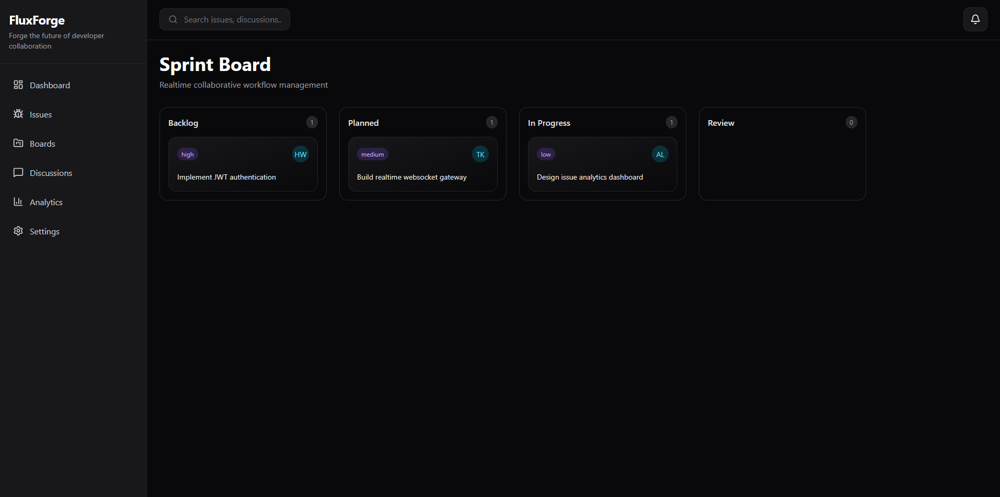
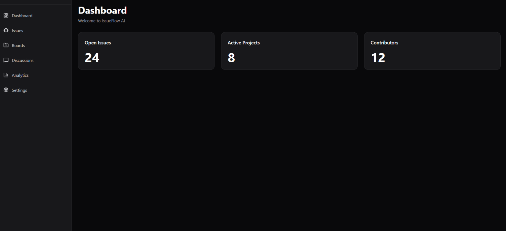

# FluxForge

Forge the future of developer collaboration.

Modern AI-powered issue tracking and realtime workflow management platform built for engineering teams, open-source communities, and modern software organizations.

---



---

## Overview

FluxForge is a modern collaborative engineering platform designed to streamline software project management, realtime team coordination, and AI-assisted development workflows.

The platform combines:

- issue tracking
- Kanban workflow management
- realtime collaboration
- AI-assisted issue intelligence
- analytics & observability
- technical discussions
- project documentation
- developer productivity systems

FluxForge is designed as a production-grade full-stack engineering platform showcasing scalable architecture, realtime systems, modern frontend engineering, and cloud-native backend development.

---

# Features

## Realtime Kanban Workflows

- Drag & drop sprint boards
- Backlog management
- Realtime issue movement
- Sprint planning workflows
- Team collaboration boards

---

## AI-Assisted Issue Intelligence

- AI-generated issue summaries
- Duplicate issue detection
- Priority recommendations
- Sprint workload estimation
- Risk analysis
- Issue clustering

---

## Collaborative Engineering Workspace

- Threaded issue comments
- Developer discussions
- Team activity feeds
- Live notifications
- Presence indicators
- Realtime synchronization

---

## Developer Documentation System

- Markdown wiki
- Architecture notes
- API documentation
- Release notes
- Engineering guides

---

## Analytics & Observability

- Sprint velocity
- Project health metrics
- Contributor analytics
- Release progress tracking
- Team productivity insights

---

# Tech Stack

## Backend

- FastAPI
- PostgreSQL
- Redis
- SQLAlchemy
- Alembic
- Celery
- JWT Authentication
- WebSockets

---

## Frontend

- React
- TypeScript
- Vite
- TailwindCSS v4
- Zustand
- React Query
- Framer Motion
- DnD Kit

---

## Infrastructure

- Docker
- Docker Compose
- Nginx
- GitHub Actions
- Prometheus
- Grafana
- OpenTelemetry

---

# Architecture

FluxForge follows a scalable monorepo architecture designed for modularity, maintainability, and production-grade deployment workflows.

```txt
fluxforge/
│
├── apps/
│   ├── api/               # FastAPI backend
│   ├── web/               # React frontend
│   ├── realtime/          # WebSocket gateway
│   └── workers/           # Celery workers
│
├── packages/
│   ├── ui/                # Shared UI library
│   ├── types/             # Shared types
│   └── config/            # Shared configs
│
├── infrastructure/
│   ├── docker/
│   ├── nginx/
│   └── monitoring/
│
├── docs/
│   ├── architecture/
│   ├── diagrams/
│   └── screenshots/
│
└── .github/
```

---

# Screenshots

## Sprint Board


---

## Dashboard



---

# Current Development Status

## Completed

- Monorepo architecture
- FastAPI backend initialization
- React + TypeScript frontend
- TailwindCSS v4 setup
- Dashboard shell
- Sidebar navigation
- Kanban board UI
- Dark SaaS design system

---

## In Progress

- Routing system
- Drag & drop Kanban engine
- Zustand state management
- Backend API integration
- Realtime WebSocket synchronization

---

# Roadmap

## Phase 1 — Core Platform

- Authentication system
- Issue CRUD
- Kanban engine
- PostgreSQL integration
- Project boards

---

## Phase 2 — Collaboration

- Realtime sync
- Notifications
- Discussions
- Activity feeds
- Team presence system

---

## Phase 3 — AI Layer

- AI issue summarization
- Duplicate detection
- Sprint recommendations
- Workflow intelligence

---

## Phase 4 — Observability

- Analytics dashboard
- Monitoring stack
- OpenTelemetry
- Performance tracking

---

## Phase 5 — Open Source Scaling

- Public deployment
- Contributor onboarding
- Plugin ecosystem
- Community expansion

---

# Quick Start

## Clone Repository

```bash
git clone https://github.com/HendyWab/fluxforge.git
cd fluxforge
```

---

## Backend

```bash
cd apps/api

python -m venv .venv

# Windows
.venv\Scripts\activate

# Linux/macOS
source .venv/bin/activate

pip install -r requirements.txt

uvicorn app.main:app --reload
```

Backend:
```txt
http://127.0.0.1:8000
```

Swagger:
```txt
http://127.0.0.1:8000/docs
```

---

## Frontend

```bash
cd apps/web

npm install
npm run dev
```

Frontend:
```txt
http://localhost:5173
```

---

# Project Vision

FluxForge aims to become:

- a flagship open-source engineering platform
- a realtime collaborative developer workspace
- an AI-native workflow management system
- a scalable engineering operations platform

The project is intentionally designed to demonstrate:

- frontend engineering
- backend architecture
- realtime systems
- AI integration
- DevOps maturity
- cloud-native infrastructure
- scalable monorepo organization

---

# Contributing

Contributions, feature ideas, architecture discussions, and improvements are welcome.

Future contributor resources will include:

- contribution guides
- issue templates
- architecture documentation
- development workflows
- plugin system documentation

---

# Author

## HendyWab

Building modern engineering systems, realtime platforms, and AI-native developer tooling.

---

# License

MIT License